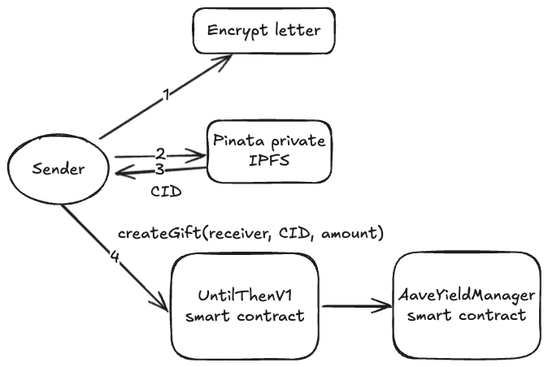
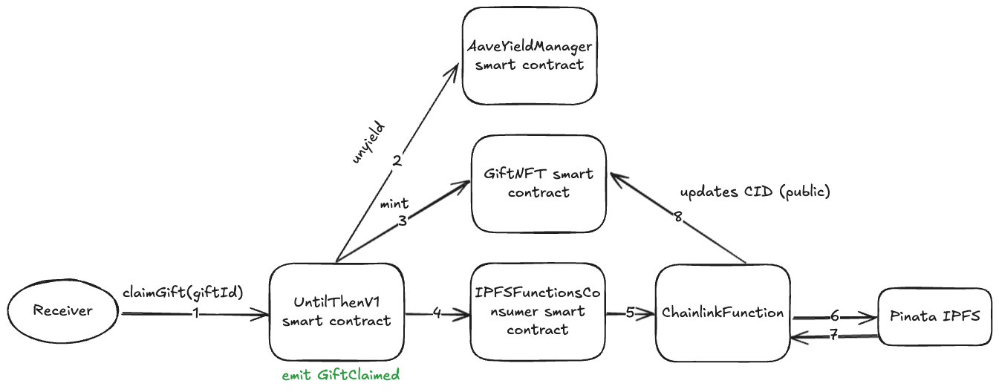
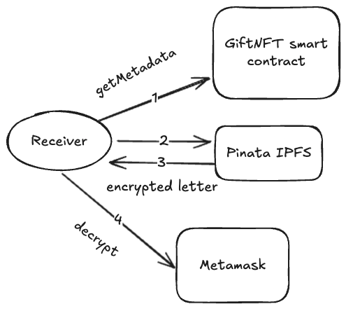
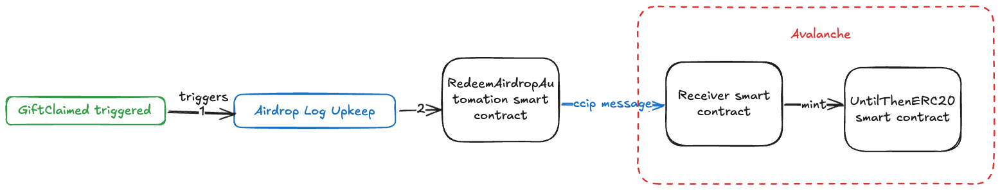
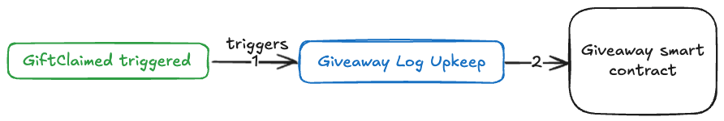
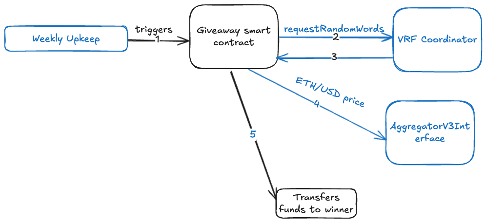

# Until Then 🎁

This project was developed during the 2025 Chromion Chainlink Hackathon.

## Inspiration

This project was inspired by Violet Evergarden's episode "A Loved One Will Always Watch Over You," where a sickly mother hires Violet, a writer, to write 50 intimate letters to her daughter. The letters are sent on the daughter's birthday after the mother passes away. For 50 years, the daughter receives memorable letters from her deceased mother.

With this project, I wanted to implement a similar idea but using a decentralized solution. In the anime, the letters were sent by a postal company that could lose the letters or go out of business.

## Features

Until Then offers the following features:

- A user can send a gift with an optional letter together with money. The sender chooses a release date.
- The sender can choose to yield the money in AAVE with ETH or LINK so the gift amount can potentially grow while locked.
- A receiver can only claim the gift on the release date.
- After the gift is claimed, the receiver gets the money and can decrypt the letter content.
- Every week, there is a $100 giveaway for users who claim a gift.
- The first 100 users receive an airdrop of UNTIL tokens on Avalanche.

## How it works

### Letter encryption

In this initial phase, the letter is encrypted using the receiver's MetaMask public encryption key. The UI offers an easy way to generate this key so the receiver can share it with the sender.  
After claiming, the receiver can decrypt the letter using MetaMask.

### Locking the letter content

Since everything is public on Ethereum, the letter content is stored in Pinata's private IPFS. This guarantees that the receiver cannot decrypt or read the content before the release date.

During the claiming process, a Chainlink Function triggered by the `UntilThenV1` contract moves the file to Pinata's public IPFS and updates the content CID in the NFT. Then the UI allows the user to read that IPFS file and decrypt the content with MetaMask.

You can find the Chainlink Function files [here](./chainlink-function/src/source.js). That folder also includes some utility files used during development.  
You can find the smart contract calling the Chainlink Function [here](./smart-contracts/src/IPFSFunctionsConsumer.sol).

During this flow, a `GiftClaimed` event is triggered.

### Airdrop

A log-based Upkeep listens to the `GiftClaimed` event. When triggered, using Chainlink CCIP, a message is sent to a `Receiver` on Avalanche. The message includes the `mint` signature of the UNTIL ERC20 contract on Avalanche. Once the message is received, 500 tokens are minted to the receiver's wallet.

You can find the smart contracts related to the log automation and CCIP [here](./smart-contracts/src/avalanche-airdrop/).

CCIP Transaction example: [0x19b8ce134e75d517a248a037be27bcff8a8e624be104170b53de801cb7dae348](https://ccip.chain.link/#/side-drawer/msg/0x19b8ce134e75d517a248a037be27bcff8a8e624be104170b53de801cb7dae348)

### Giveaway

Another log-based Upkeep listens to the `GiftClaimed` event. When triggered, the receiver is added to an array of users entitled to participate in the giveaway.

A time-based Upkeep runs weekly and chooses a winner using Chainlink VRF for randomness. Then it uses a price feed to transfer the equivalent of $100 in ETH to the winner.

You can find the smart contract related to the log and time-based automation [here](./smart-contracts/src/Giveaway.sol).

### Yield

When the sender creates the gift, they can choose to yield the tokens. This makes sense if the gift will be redeemed in the future, allowing the gift amount to earn APY so the receiver gets a higher amount.

The app supports yield with ETH and LINK.

### Fees

The app has different types of fees:

- Letter upload fee: 0.01 ETH (0 if there is no letter)
- No Yield: If the user sends ETH with no yield, a fixed 0.0001 ETH fee is charged.
- Yield: If the user chooses to yield ETH or LINK, no upfront fee is charged. When the gift is claimed, a fee of 10% of the amount plus yield is taken, or 0.0001 ETH / 0.05 LINK — whichever is higher.

Some of these fees are used to fund the Chainlink services and the giveaway.

## Stack

### UI

The UI was implemented using React, Next.js, and Tailwind CSS, and deployed on Vercel.

### Smart contracts

The smart contracts were developed in Solidity and deployed to Sepolia.

## Codebase

- [chainlink-fuction](./chainlink-function/): Includes codebase related to the Chainlink Function
- [frontend](./frontend/): Includes the web app
- [smart-contracts](./smart-contracts/): Includes the smart contracts implementation

## Contracts addresses

### Sepolia

| Contract Name                | Address                                      |
|------------------------------|----------------------------------------------|
| `UntilThenV1.sol`            | `0xefA2408BDc98e783440A1B27d72827cec8A399d8` |
| `GiftNFT.sol`                | `0x2F901523DE07a64A05Eb65028Fb7BBcB991681f4` |
| `AaveYieldManager.sol`       | `0x9bC2359CF283BF2B91b96aD9491d9A8Fc1f13123` |
| `Giveaway.sol`               | `0x01927971547Ec6771e1fc0A9CAdCfA85F9aCCf03` |
| `RedeemAirdropAutomation.sol`| `0x30DCDaFD1B0B2C702FE67d1bF0f61821970BB7aA` |

### Avalanche Fuji

| Contract Name                | Address                                      |
|------------------------------|----------------------------------------------|
| `Receiver.sol`               | `0xC17778DaC70f33d58a6D594bC1aD7f58a4F5Fa4B` |
| `UntilThenER20.sol`          | `0x3164d84A42ec935f620d73a2e22C8b3E2Cb049aE` |

You can find other addresses used in [here](./smart-contracts/script/HelperConfig.s.sol)

## Demo

You can find a working demo on Sepolia [here](https://until-then.vercel.app/).

For ETH, you can get test tokens [here](https://cloud.google.com/application/web3/faucet/ethereum/sepolia).  
For LINK, you can get tokens [here](https://app.aave.com/faucet/). Note: The tokens used are AAVE LINK tokens that support yield on Sepolia.

For letter encryption, the app supports MetaMask.

## Useful commands

Each project folder includes its own set of commands. Check the `README.md` or `package.json` in each folder for details.
